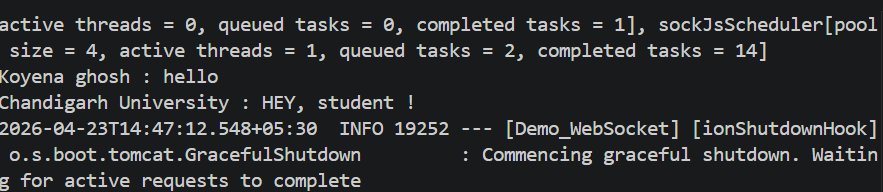

# WebSocket Chat Application

Real-time chat app using Spring Boot and React.

## Run Backend
mvn spring-boot:run

## Run Frontend
cd my-react-app
npm install
npm run dev

## Output
Users can send and receive messages in real time.

